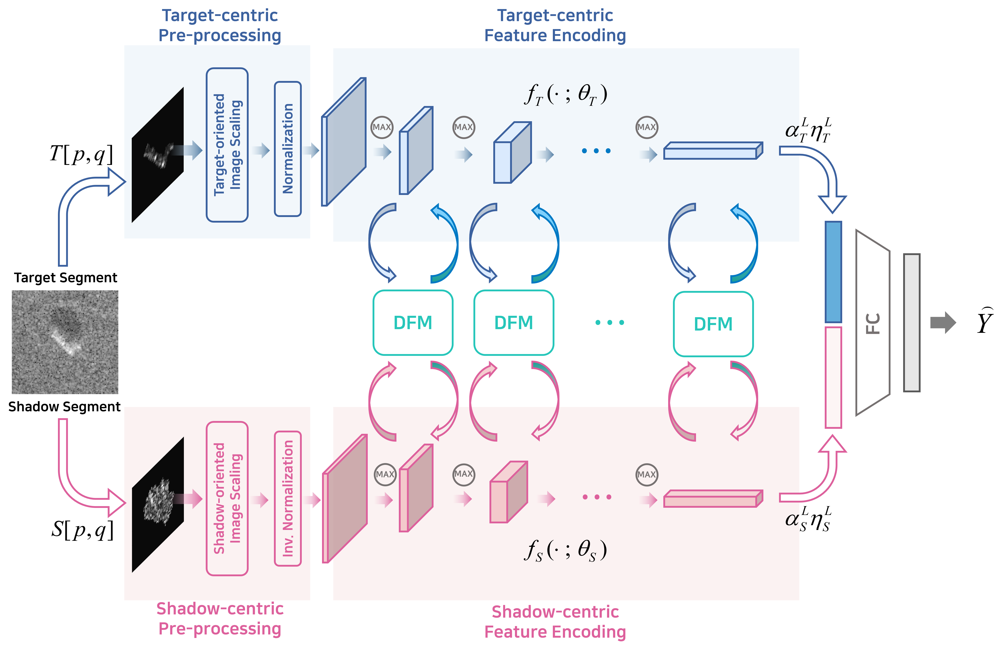

# SARATR_Fusion

*Advanced SAR ATR algorithm based on the information fusion of target and shadow regions*. This is part of the paper: _Fusion of Target and Shadow Regions for Improved SAR ATR_ published at IEEE TGRS'22.

 

  

Dataset
----------
We used the public MSTAR dataset for evaluating our algorithm. To download the dataset, please visit the following **[Official Link](https://www.sdms.afrl.af.mil/index.php?collection=mstar)**. 